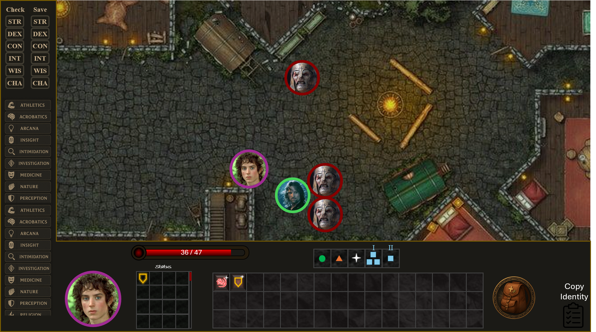

# D&D OS VTT

A modern open source baldurs-gate-3 inspired Virtual Tabletop built with PeerJS for networking and PixiJS.

Specifically designed to have a D&D battle engine, automating away some of the annoying parts of D&D - rolling dice, remembering your character effects etc.

Including a custom scripting system, for characters. The battle engine has specific events like "TurnBegin", "TurnEnd", "PlayerStart", "PlayerEnd".



This VTT is intended mainly as a Battleground and Resource management VTT. Currently exploration gameplay is not planned.

## Features

- **Modern Dark UI**: Beautiful dark-themed interface inspired by Baldur's Gate 3
- **Real-time Networking**: Peer-to-peer connections using PeerJS
- **Interactive Battle Map**: PixiJS-powered map rendering with lighting effects
- **Character Management**: Complete character sheets with attributes, skills, and inventory
- **Combat System**: Automated initiative tracking and turn management
- **Dice Rolling**: Integrated dice rolling system for checks and saves
- **DM Interface**: Separate interface for Dungeon Masters with additional controls

## Quick Start

### Prerequisites

- Node.js (v16 or higher)
- npm or yarn

### Installation

1. Clone the repository:
```bash
git clone https://github.com/yourusername/ddos-vtt.git
cd ddos-vtt
```

2. Install dependencies:
```bash
npm install
```

3. Start the development server:
```bash
npm run dev
```

4. **Important**: For networking features to work, you also need to start the PeerJS server in a separate terminal:
```bash
npm install -g peer
peer --port 9000
```

5. Open your browser and navigate to:
   - `http://localhost:3000` - Player interface
   - `http://localhost:3000/dm` - DM interface

**Note**: If you see PeerJS connection errors in the browser console, make sure the PeerJS server is running on port 9000.

## Troubleshooting

### Common Issues

1. **PixiJS Errors**: If you see `TypeError: PIXI.Sprite.from is not a constructor`, try:
   - Restart the development server: `npm run dev`
   - Clear browser cache and refresh the page

2. **PeerJS Connection Errors**: If you see `ERR_CONNECTION_REFUSED` for PeerJS:
   - Make sure the PeerJS server is running: `peer --port 9000`
   - Check that port 9000 is not being used by another application

3. **TypeScript Errors**: If you see module resolution errors:
   - Run `npm install` to ensure all dependencies are properly installed
   - Restart your IDE/editor

## Usage

### Player Interface (`/`)

The main player interface includes:
- **Character Sheet**: View and manage character attributes, skills, and status effects
- **Battle Map**: Interactive map with character tokens and lighting
- **Inventory**: Manage character inventory and items
- **Combat Controls**: Start/end combat and manage turns

### DM Interface (`/dm`)

The DM interface provides additional controls:
- **Character Management**: Add/remove NPCs and manage all characters
- **Fog of War**: Control visibility and lighting
- **Player Management**: Manage connected players
- **DM Settings**: Advanced configuration options

### Networking

The VTT uses PeerJS for peer-to-peer networking:
- Each player gets a unique Peer ID
- Players can connect to each other using these IDs
- All game state is synchronized in real-time

## Project Structure

```
src/
├── components/          # React components
│   ├── GameInterface.tsx
│   ├── DMInterface.tsx
│   ├── MapRenderer.tsx
│   ├── CharacterSheet.tsx
│   └── Inventory.tsx
├── store/              # State management
│   └── gameStore.ts
├── networking/         # PeerJS networking
│   └── peerManager.ts
├── types/              # TypeScript type definitions
│   └── index.ts
├── data/               # Sample data
│   └── sampleData.ts
└── styles/             # CSS styles
    └── App.css
```

## Development

### Available Scripts

- `npm run dev` - Start development server
- `npm run build` - Build for production
- `npm run preview` - Preview production build
- `npm run lint` - Run ESLint

### Adding New Features

1. **New Character Types**: Extend the `Character` interface in `src/types/index.ts`
2. **New Map Features**: Add properties to the `Map` interface
3. **Custom Scripts**: Implement in the battle engine system
4. **UI Components**: Create new components in `src/components/`

### Networking Setup

For production deployment, you'll need to set up a PeerJS server:

```bash
npm install -g peer
peer --port 9000
```

Then update the PeerJS configuration in `src/networking/peerManager.ts`.

## Contributing

1. Fork the repository
2. Create a feature branch (`git checkout -b feature/amazing-feature`)
3. Commit your changes (`git commit -m 'Add amazing feature'`)
4. Push to the branch (`git push origin feature/amazing-feature`)
5. Open a Pull Request

## License

This project is licensed under the MIT License - see the LICENSE file for details.

## Acknowledgments

- Inspired by Baldur's Gate 3's UI design
- Built with React, TypeScript, PixiJS, and PeerJS
- Special thanks to the D&D community for feedback and testing

## Map detail

Glaringly the characters have no movement controls! reminder, the movement controls should be grid based, moving up/down/left/right/diagnoally 1 square to the left should take 1 "speed". I imagine we will give the map component the character data

```ts
type characterData = {
  speed: {
    getCurrent: () => number
    setCurrent: (i: number) => void
  }
}
type isTurn = true | false //whether it's the current player's turn and thus whether movement controls etc. should be displayed

<Map character={myCharacterData} isTurn={myTurn}>
```


Existing problem: Grid is finite

Wait... I need to stop you there, the movement design is entirely wrong... With the character selected, I need you to detect the position of the mouse, and draw a movement line to the cursor (which follows the grid). The line should be indicated by yellow dots in the grid squares, each yellow dot representing 1 space of movement. Also, I want this to work even if the mouse is clicking too far away. Obviously the character only moves as far as he can possibly move, as also shown by the yellow dotted line. Does that make sense? I don't want a seperate movement window with buttons for all the directions!

-----------

The movement system currently for the @Map.tsx  and @PlayerInterface.tsx is messed up. We need to fix this. With the character selected, I need you to detect the position of the mouse, and draw a movement line to the cursor (which follows the grid). The line should be indicated by yellow dots in the grid squares, each yellow dot representing 1 space of movement. Also, I want this to work even if the mouse is clicking too far away. Obviously the character only moves as far as he can possibly move, as also shown by the yellow dotted line. Does that make sense? I don't want a seperate movement window with buttons for all the directions!

It is important to note that the map control should look something like this:

```ts
type characterData = {
  speed: {
    getCurrent: () => number
    setCurrent: (i: number) => void
  }
}
type isTurn = true | false //whether it's the current player's turn and thus whether movement controls etc. should be displayed

<Map character={myCharacterData} isTurn={myTurn}>
```
when it is finally in use.

-----

I have a problem with the movement system as it currently stands in @Map.tsx. Currently the yellow dots render all the way to the mouse cursor. This should not be the case. Instead yellow dots should render up until the last speed number is used up and no more. I.E.

numberOfYellowDots = characterData.speed.getCurrent()
distanceFromToken = numberOfYellowDots

Note: I still want to be able to click far away and have the character move, and where the player moves to is perfectly fine. I just want the last yellow dot to be where the player will end up. Does that make sense?

---

I just updated the movement preview so the yellow dots stop exactly at the reachable endpoint (clamped by speed), and the count equals the speed (or fewer if the target is closer). I'll run a quick lint check on the modified file.

What was wrong
The preview path used a step count based on the target distance and sometimes appended the target, which made dots extend to the cursor.
What I changed
The path now clamps to the reachable endpoint and generates dots only up to that point:
Compute the clamped endpoint at distance min(speed, distanceToTarget)
Generate dots between start and this clamped endpoint
Steps equal floor(reachableDistance) so when out of range, dots count ≈ speed; if closer, fewer dots
Removed the extra append of the actual target so dots no longer extend past the reachable position.
You still can click far away; movement on click remains unchanged and will move to the max reachable grid cell if the target is out of range.
